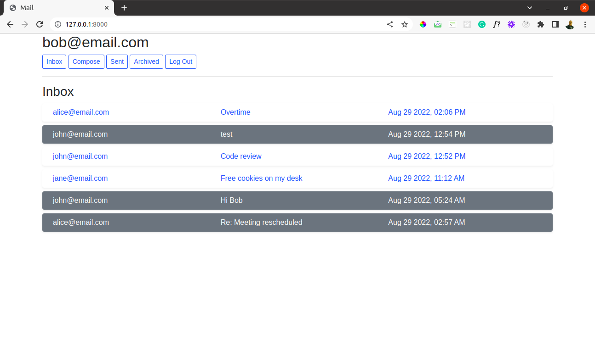

# CS50_Mail
Design a front-end for an email client that makes API calls to send and receive emails.

### Specification

Using JavaScript, HTML, and CSS, complete the implementation of your single-page-app email client inside of inbox.js (and not additional or other files; for grading purposes, we’re only going to be considering inbox.js!). You must fulfill the following requirements:

- **Send Mail:** When a user submits the email composition form, add JavaScript code to actually send the email.
    - You’ll likely want to make a POST request to /emails, passing in values for recipients, subject, and body.
    - Once the email has been sent, load the user’s sent mailbox.
- **Mailbox:** When a user visits their Inbox, Sent mailbox, or Archive, load the appropriate mailbox.
    - You’ll likely want to make a GET request to /emails/<mailbox> to request the emails for a particular mailbox.
    - When a mailbox is visited, the application should first query the API for the latest emails in that mailbox.
    - When a mailbox is visited, the name of the mailbox should appear at the top of the page (this part is done for you).
    - Each email should then be rendered in its own box (e.g. as a 
 with a border) that displays who the email is from, what the subject line is, and the timestamp of the email.
    - If the email is unread, it should appear with a white background. If the email has been read, it should appear with a gray background.
- **View Email:** When a user clicks on an email, the user should be taken to a view where they see the content of that email.
    - You’ll likely want to make a GET request to /emails/<email_id> to request the email.
    - Your application should show the email’s sender, recipients, subject, timestamp, and body.
    - You’ll likely want to add an additional div to inbox.html (in addition to emails-view and compose-view) for displaying the email. Be sure to update your code to hide and show the right views when navigation options are clicked.
    - Once the email has been clicked on, you should mark the email as read. Recall that you can send a PUT request to /emails/<email_id> to update whether an email is read or not.
Archive and Unarchive: Allow users to archive and unarchive emails that they have received.
When viewing an Inbox email, the user should be presented with a button that lets them archive the email. When viewing an Archive email, the user should be presented with a button that lets them unarchive the email. This requirement does not apply to emails in the Sent mailbox.
Recall that you can send a PUT request to /emails/<email_id> to mark an email as archived or unarchived.
Once an email has been archived or unarchived, load the user’s inbox.
Reply: Allow users to reply to an email.
When viewing an email, the user should be presented with a “Reply” button that lets them reply to the email.
When the user clicks the “Reply” button, they should be taken to the email composition form.
Pre-fill the composition form with the recipient field set to whoever sent the original email.
Pre-fill the subject line. If the original email had a subject line of foo, the new subject line should be Re: foo. (If the subject line already begins with Re: , no need to add it again.)
Pre-fill the body of the email with a line like "On Jan 1 2020, 12:00 AM foo@example.com wrote:" followed by the original text of the email.
## Built With

- Django4, Python, Javascript
- Bootstrap 
- HTML 5
- CSS3
## YouTube Demo

[Video_Link](https://www.youtube.com/watch?v=r9z_3UJDp-Q)

## Author

👤 **Author**

[https://github.com/ggotora](https://github.com/ggotora)

## 🤝 Contributing

Contributions, issues and feature requests are welcome!

Feel free to check the [issues page](https://github.com/ggotora/CS50_Project3_Mail/issues/1).

## Show your support

Give a ⭐️ if you like this project!

# 📝 License

This project is [MIT](LICENSE) licensed.
